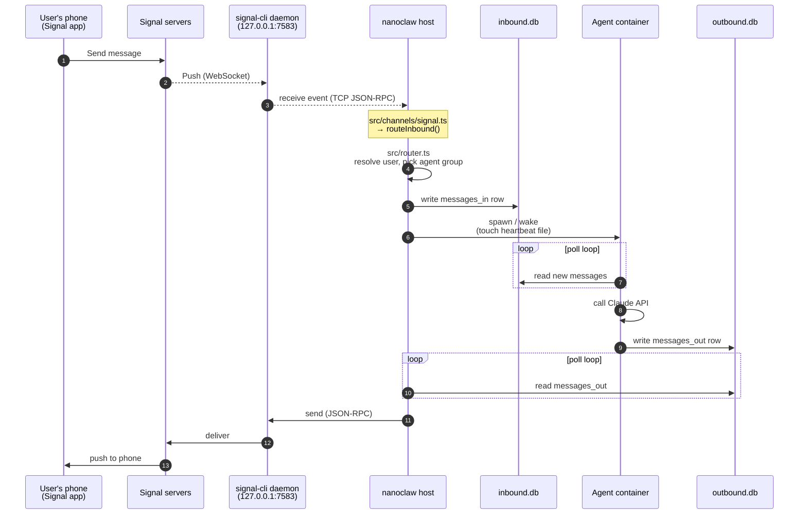
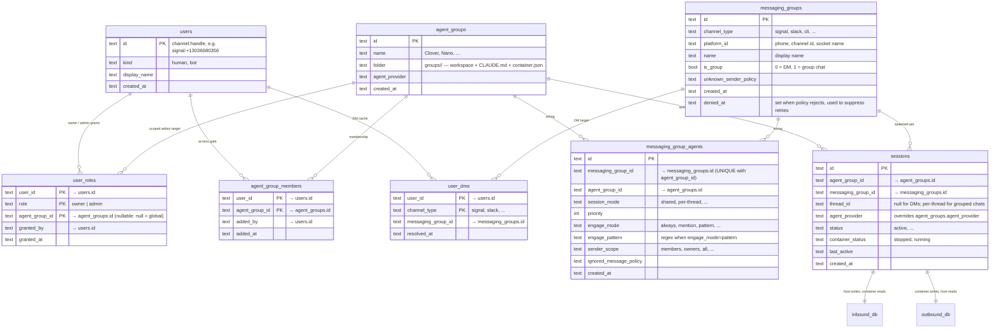

# Understanding NanoClaw

How a message moves through the system, and how the entities that make routing possible relate to each other.

## Message flow (Signal example)

End-to-end path of a Signal DM through nanoclaw. Push-driven from the user's phone all the way to the container's mailbox; only the container ↔ host link uses polling, because SQLite is the sole IO surface across the mount boundary.

## What's pushed vs polled

| Hop | Mechanism |
|---|---|
| Signal servers ↔ signal-cli | WebSocket push |
| signal-cli ↔ nanoclaw host | TCP JSON-RPC subscription (push) |
| host → container (`inbound.db`) | host writes, container polls |
| container → host (`outbound.db`) | container writes, host polls |
| host → signal-cli → user | JSON-RPC + WebSocket push |

Polling exists only at the container ↔ host boundary because the two run in different filesystems and the SQLite session DBs are the single shared IO surface — no IPC, no stdin piping. See [docs/db.md](db.md) and [docs/architecture.md](architecture.md).

## Data model

Routing only makes sense once you know the three entity types and the table that wires them together.

### The three entities

- **`users`** — anyone who can send messages. ID is `<channel>:<handle>` (e.g. `signal:+13036680356`), so the same human on Signal and Slack is two different user rows. `kind` distinguishes humans from bots.
- **`messaging_groups`** — one row per *chat*, not per user: a Signal DM, a Slack channel, the local CLI socket. Identified by `(channel_type, platform_id)`. `unknown_sender_policy` decides what happens when someone not on the access list sends a message.
- **`agent_groups`** — the personas (Clover, Nano, Terminal Agent). Each has its own folder under `groups/`, its own `CLAUDE.md`, its own `container.json`, and its own per-group memory file. An agent group is a long-lived identity; sessions are how it actually runs.

### The wiring

- **`messaging_group_agents`** is the routing table. Many-to-many: a messaging group can fan out to multiple agents (group chats with several bots), and an agent can serve many messaging groups (Clover answering on Signal *and* Slack). Per-row settings control session mode, trigger rules (when to engage), and priority for tie-breaking.
- **`sessions`** is the runtime unit: one row per `(agent_group, messaging_group, thread_id)`. The router resolves which session(s) a message wakes; the host spawns/wakes a container per session. Each session owns its two SQLite files under `data/v2-sessions/<agent-group>/<session>/` — `inbound.db` (host→container) and `outbound.db` (container→host).

### Privileges and DMs

Three small tables, each referencing `users.id` as a foreign key.

- **`user_roles`** holds owner/admin grants. Composite primary key `(user_id, role, agent_group_id)` — so the same user can hold the same role multiple times at different scopes. `agent_group_id` is nullable: a `NULL` scope means the role is global, a non-null value scopes the role to that one agent group. `granted_by` records which user issued the grant. There is no env-var equivalent; this table is the source of truth for who's allowed to do what.
- **`agent_group_members`** is the access gate for unprivileged users. Composite key `(user_id, agent_group_id)`. If you're not a member (and not an owner / not a global or scoped admin), the agent group's `unknown_sender_policy` decides whether your inbound message is rejected, queued for approval, etc.
- **`user_dms`** is a cache mapping `(user_id, channel_type) → messaging_group_id`. Used for cold DMs ("send Charlie a message" when there's no active session): the host needs to know *where* Charlie's Signal DM is. First contact on a channel populates the row; later cold sends look it up instead of probing.
